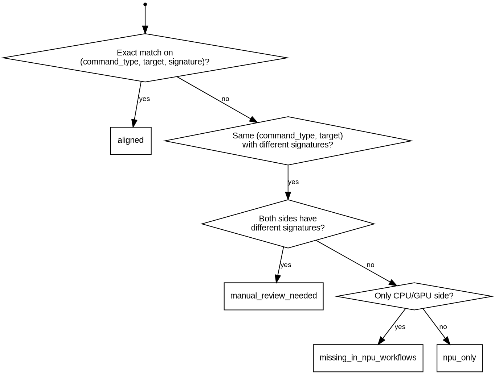

# Ascend CI Case Diff Scan

Static analyzer that compares CPU/GPU workflow test cases against Ascend NPU workflow coverage in a `verl` repository. Reads GitHub Actions `run:` commands, preserves workflow/job/step context, and does not execute tests.

## Quick Reference

| | |
|---|---|
| **Input** | `.github/workflows/*.yml` in target verl repo |
| **UT extraction** | `pytest ... tests/...` → function-level (`test_*` / `Test*::test_*`) via AST |
| **ST extraction** | `bash tests/*.sh`, `bash examples/*.sh`, `torchrun ... tests/...` → command-level |
| **Classification** | `aligned` → `manual_review_needed` → `missing_in_npu_workflows` / `npu_only` |
| **Output** | `report.md` + `report.xlsx` (4 sheets) |
| **Past-N-days** | `--since-days N` adds `report-past-N.md` + `report-past-N.xlsx` |
| **Config** | `config/workflow_scope.json` — ignored workflow glob patterns |

## When to Use

- Auditing NPU CI coverage before a release
- Checking whether recent CPU/GPU workflow changes have NPU equivalents
- Generating coverage gap reports for stakeholders
- CI pipeline integration for automated parity checks

**Don't use for:** executing tests, modifying workflow files, or analyzing non-GitHub-Actions CI systems.

## Instructions

1. Read [references/repo-signals.md](./references/repo-signals.md) for repo-specific boundaries.
2. Identify the target `verl` repository root.
3. Run from the `verl-ascend-recipe` root (where `.agent/` lives):

```shell
# Full audit
python .agent/skills/ascend-ci-case-diff-scan/scripts/scan_ascend_ci_case_diff.py \
  --repo-root {PATH}/verl \
  --output-dir ./report/ascend-ci-case-diff-scan

# With past-N-days incremental analysis
python .agent/skills/ascend-ci-case-diff-scan/scripts/scan_ascend_ci_case_diff.py \
  --repo-root {PATH}/verl \
  --output-dir ./report/ascend-ci-case-diff-scan \
  --since-days 7
```

`--since-days` must be a positive integer. Omit to generate only the full report.

## Extraction Rules

Recognize only these command forms (see [references/repo-signals.md](./references/repo-signals.md#extractable-command-forms)):

- `pytest ... tests/...`
- `bash tests/.../*.sh` or `bash examples/.../*.sh`
- `torchrun ... tests/...`

For each extracted case, preserve: `workflow_name`, `job_name`, `step_name`, `command_type`, `target`, `raw_command`, `signature`. Keep cases distinct when the same command appears in different workflow/job/step contexts. For UT, expand to function-level or test-method-level whenever the target file can be parsed. For ST, record only scripts explicitly invoked — do not inspect the script body.

Case matching uses `command_type`, `target`, and `signature` (see [references/repo-signals.md](./references/repo-signals.md#matching-expectations)).

## Past-N-Days Analysis

When `--since-days N` is set, the scanner walks first-parent history for commits merged in the last `N` days, compares the window-start snapshot with current `HEAD`, and reports only effective final-state changes. See [references/repo-signals.md](./references/repo-signals.md#past-n-days-expectations) for full scoping and column semantics.

## Boundaries

- Ignore commented workflow lines.
- Ignore workflows matched by `config/workflow_scope.json`, including shared baseline and workflows without meaningful CPU/GPU-vs-NPU test coverage.
- Do not execute tests.
- Do not expand GitHub Actions matrices.
- Keep the final report in English only.

## Case Classification



The classification algorithm checks in this order (strongest signal first): exact three-key match → same target with signature divergence → side-only. The report displays sections as: **Matched Cases**, **CPU/GPU-only Cases**, **NPU-only Cases**, **Manual Review** — in that order. See [references/repo-signals.md](./references/repo-signals.md#matching-expectations) for detailed matching rules.

## Common Mistakes

| Mistake | Fix |
|---------|-----|
| Expecting matrix expansion | Matrix strategies are not expanded. Dynamic test combinations from `strategy.matrix` are not detected. |
| `--since-days` ≤ 0 | Must be a positive integer. Zero or negative values raise `ValueError`. |
| Running against wrong directory | The script validates that `--repo-root` contains `.github/workflows/`. |
| Assuming ST script internals are analyzed | Only ST commands are recorded at the command level. Script bodies (`.sh`, Python) are not inspected for nested test calls. |
| Treating `manual_review_needed` as failure | Same-target/different-signature cases may still be functionally equivalent — they need human judgment, not automation. |
| Expecting NPU workflows as primary past-N-days rows | The past-N-days changed-workflow table is CPU/GPU-oriented. NPU workflows appear as support references only. |

## Reporting

The scanner writes `report.md` and `report.xlsx` to `--output-dir`. With `--since-days`, it also writes `report-past-N.md` and `report-past-N.xlsx`.

Reports contain: ignored workflows, scanned workflows with CPU/GPU and NPU case counts, UT details, ST details (matched, CPU/GPU-only, NPU-only, manual-review cases in that order with adjacent CPU/GPU and NPU references). The Excel workbook stores these as four sheets: `Ignored Workflows`, `Scanned Workflows`, `UT Cases`, `ST Cases`.
