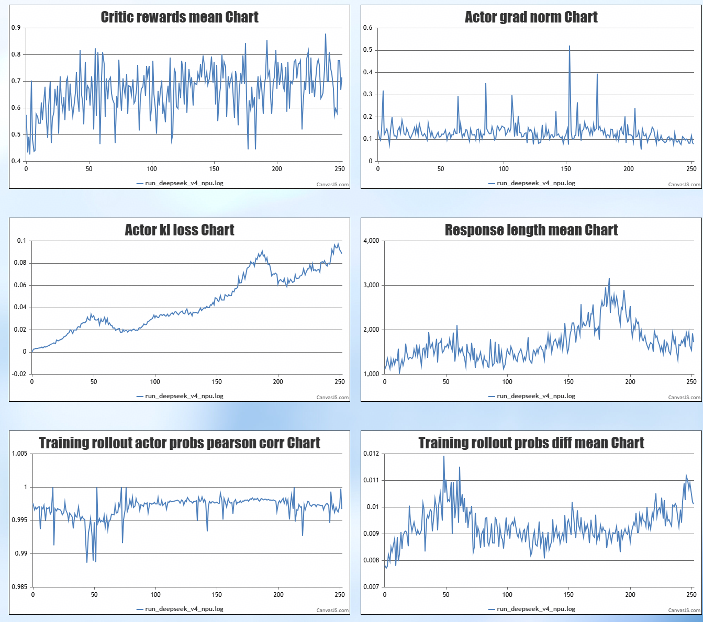

# DeepSeek-V4 on Ascend NPU
基于DeepSeek-V4-Flash模型在NPU上进行RLHF后训练的样例。

本用例基于8 x Atlas A3 实现， 开发者可以参照调整。

## 环境版本
由于当前部分组件依赖尚未发布正式版本，我们将提供用于快速复现的基础镜像及部署方法，获取参照环境部署章节，主要依赖版本如下
后续会更新正式版本

| 依赖组件                 | 版本            | 
| :--------------------- | :------         | 
| CANN                   | 9.1.0           | 
| PyTorch                | 2.10.0          | 
| torch\_npu             | 2.10.0          | 
| verl                   | 809f2d8         | 
| vLLM                   | v0.23.0         | 
| vLLM-Ascend            | releases/0.23.0 | 
| MindSpeed-LLM          | 99f7fc1 (master)| 
| MindSpeed              | 1becca8 (master)| 
| Megatron               | core_v0.12.1    | 


### 环境部署
我们基于VLLM+MindSpeed-LLM后端支持DeepSeekV4的强化学习, 使用verl日构建开源镜像作为基础镜像，请使用此镜像作为基础镜像安装环境

```bash

# verl日构建开源镜像
docker pull quay.io/ascend/verl:verl-9.0.0-a3-ubuntu22.04-py3.11-latest

# 创建容器
docker run -dit --ipc=host --network host --name 'rl_test' --privileged -v /usr/local/Ascend/driver:/usr/local/Ascend/driver -v /usr/local/Ascend/firmware:/usr/local/Ascend/firmware -v /usr/local/sbin/:/usr/local/sbin/ -v /home/:/home/ -v /data/:/data 镜像名:标签 /bin/bash

# 进入容器
docker exec -it rl_test bash
mkdir /workspace-verl 
cd /workspace-verl

# 安装环境依赖
git clone https://github.com/verl-project/verl-ascend-recipe.git
bash verl-ascend-recipe/deepseekv4/scripts/install.sh

# 创建软链接
cd verl
ln -s ../MindSpeed/mindspeed mindspeed
ln -s ../MindSpeed-LLM/mindspeed_llm mindspeed_llm
ln -s ../Megatron-LM/megatron megatron
ln -s ../mbridge/mbridge mbridge
```

### 权重下载与反量化

1. 权重下载

    从 [huggingface](https://huggingface.co/deepseek-ai/DeepSeek-V4-Flash-Base) 下载权重和配置文件

2. 权重转换

    开源DeepSeekV4-Flash权重为FP8 mixed数据格式，使用A3训练前需要对原始权重做反量化后获得bf16格式的权重，反量化方法请参考下述脚本
    ```bash
    cd MindSpeed-LLM
    bash examples/mcore/deepseek4_flash/ckpt_dequant_deepseek4_fp8_to_bf16.sh
    ```

### 启动训练
请根据实际数据/权重等路径修改ray_start.sh 以及 train_deepseek_v4_grpo_mindspeed_vllm.sh的中相应路径
```bash
cd verl
bash ../verl-ascend-recipe/deepseekv4/scripts/ray_start.sh
```

### 训练效果

长跑250步训练效果曲线示例：

