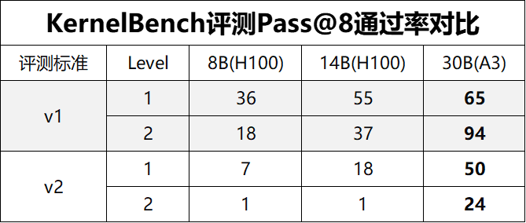

# 昇腾原生训练Triton算子生成模型实践

本目录包含昇腾原生训练Triton算子生成模型的SFT训练方案，基于Qwen3-30B模型进行了NPU-Triton算子生成后训练。经SFT模型生成的NPU-Triton算子在kernelbench上的通过率和Fast@1/1.2指标均大幅提升，且横向对比GPU-Triton算子，训练后结果达到开源SOTA水准。


## 概述
由于开源的权重在昇腾上无法生成高质量的算子，如果我们直接进行RL训练，则会由于一直采样不到正样本而导致实验失败。我们需要先进行SFT让模型具备一些基础的昇腾算子生成能力。整体的训练流程在 [Dr.kernel](https://github.com/hkust-nlp/KernelGYM) 的基础上做了昇腾NPU的适配。此外，我们还搭建了数据合成的Pipeline合成高质量的SFT多轮轨迹数据集。

## 数据集
### 数据蒸馏
我们通过 **LLM 多轮对话 + 沙箱验证** 的方式，自动循环五轮将 torch 算子代码改写为 Triton 算子代码，分为以下阶段：

**Round 1: 冷启动生成** 

LLM 首次接触 PyTorch 代码，在没有先验反馈的情况下，独立完成分析和改写。

- 输入 PyTorch 源码，要求 LLM 分析计算逻辑并设计 Triton 优化方案
- LLM 先思考优化策略，再输出完整的 Triton 实现
- 从 LLM 响应中提取代码块并在沙箱中进行测试

**Round 2+: 反馈驱动迭代**

从第二轮起，LLM 不再凭空生成，而是基于沙箱的客观验证反馈做有针对性的改进。

- 保留完整对话历史，LLM 可以回溯之前所有的尝试和结果
- 沙箱反馈包含三个维度的信号，LLM 根据反馈自行判断当前问题，选择修复或优化策略。

**终止策略**

达到最大轮数上限时停止，让 LLM 在通过后仍有机会继续优化性能。考虑到序列长度，我们目前共进行五轮对话。


## SFT数据合成
经评估，与deepseek-v4-pro对话5轮的长度是可以控制在64K以内的，而5轮数据和8轮数据算子通过率仅差不到3%。因此我们主要合成了5轮的数据，再经过一系列清洗、过滤、shape泛化，当前这部分训练数据已开源。

## 前置条件
### 1.创建环境
```bash
conda create -n your_env python=3.11
conda activate your_env
```

### 2. 安装依赖

```bash
cd sft
bash setup.sh
```

这将:
- 安装torch与torch-npu
- 初始化VERL子模块
- 安装VERL及其依赖
- 安装额外的包（vLLM、flash-attention等）

## 训练

### SFT 冷启动

```bash
cd sft
bash kernel/scripts/sft_run.sh
```

### 配置项

```bash
# sft_run.sh
--train_batch_size          # 全局 Batch Size（所有 NPU 聚合后的 batch size）
--micro_batch_size_per_gpu  # 单张 NPU 的 Micro Batch Size
--max_length                # 训练样本最大序列长度（Token 数）
--total_epochs              # 数据集训练轮数
--dataset_name              # 数据集名称，用于实验标识和日志记录
--train_data_path           # 训练数据文件路径（Parquet 格式）
--model_name                # 基础模型名称,与下面的路径拼接使用

## coldstart_30b.sh
HDFS_MODEL_PATH=""        # 基座模型路径
HDFS_CHECKPOINT_PATH=""   # 检查点保存路径
TRAIN_DATA_PATH=""        # SFT 数据集路径
```

## 实验结果
我们在A3上评测了SFT训练后的30B模型，在NVIDIA H100上评测了drkernel开源的8B和14B权重。
以下实验结果基于两种标准进行评测：v1采用开源校验标准，精度阈值较为宽松（相对/绝对误差 1.00E-02），且允许算子实现中部分调用 torch 接口。v2则对齐工业级标准，要求纯 Triton 实现，禁止任何计算类 torch 接口调用（否则判定为作弊），并在精度校验上引入按 Dtype 区分的双指标（MERE & MARE）和 NPU 微小值截断公式，标准更为严格。

<p align="center">
  
</p>

不论是在v1标准，还是v2工业级验收标准上，我们训练后的30B模型在kernelbench上的通过率指标大幅提升。且横向对比GPU-Triton算子，训练后结果达到开源SOTA水准。