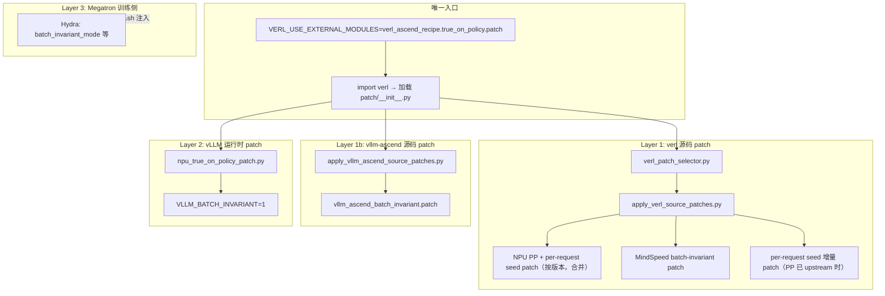

# True On-Policy Patch 设计文档

本文档描述 `true_on_policy/patch/` 目录下训推一致性（True On-Policy）适配层的设计原理与实现细节。环境搭建与快速开始见上级 [README.md](../README.md)。

---

## 1. 背景与目标

在 GRPO / GSPO / DAPO 等 RL 算法中，典型数据流为：

```
Rollout（vLLM 推理）采样 response
        ↓
Training（Megatron 训练）重算 logprob
        ↓
用 logprob 差值做策略更新
```

这要求 **训练侧与推理侧算出的 logprob 尽量一致**。若两侧算子、并行策略或数值路径不同，会出现 off-policy 漂移——名义上 on-policy，实际更新已偏离 rollout 分布。

在昇腾 NPU 上，该问题更突出：

| 侧 | 引擎 |
| --- | --- |
| 训练 | Megatron + MindSpeed |
| 推理 | vLLM-Ascend |

本 patch 模块的目标：作为 verl 的**外挂适配层**，在不修改 verl 主库的前提下，自动对齐训推差异，使用户只需运行 `scripts/*.sh` 即可，无需手动打 patch 或额外安装步骤。

---

## 2. 总体架构

Patch 系统分为三层，共用**单一入口**加载：



| 层级 | 作用对象 | 解决的问题 |
| --- | --- | --- |
| Layer 1 | verl 框架源码 | NPU 上 vLLM PP 可启动；MindSpeed repatch 与 FA3 不冲突；per-request rollout seed |
| Layer 1b | vLLM-Ascend 源码 | `batch_invariant.py` 使用 AscendC batch-invariant 算子（训推对齐） |
| Layer 2 | vLLM-Ascend 推理 runtime | MoE / logprob / TP 等数值路径与训练侧对齐 |
| Layer 3 | MindSpeed 训练配置 | 训练侧启用 batch-invariant 路径（由启动脚本 Hydra 参数控制） |

---

## 3. 唯一入口与加载顺序

训练脚本设置：

```bash
export VERL_USE_EXTERNAL_MODULES=verl_ascend_recipe.true_on_policy.patch
```

verl 在 `verl/__init__.py` 中通过 `importlib.import_module()` 加载该模块，触发 `patch/__init__.py`：

```python
apply_verl_source_patches()        # Layer 1：改 verl 源码
apply_vllm_ascend_source_patches() # Layer 1b：改 vllm-ascend 源码（batch_invariant.py）
apply_batch_consistency_patches()  # Layer 2：vLLM-Ascend runtime monkey patch
```

**必须先 Layer 1 / 1b 后 Layer 2**：`patch/__init__.py` 会先 `git apply` verl / vllm-ascend 源码，再 import `npu_true_on_policy_patch`（避免提前加载未 patch 的 `verl.workers.config.rollout`）。后续 import 的 rollout 模块依赖 patch 后源码；batch-invariant 由源码 patch 直接写入 `vllm_ascend/batch_invariant.py`，不再做运行时替换。

### 前置条件

- recipe 已复制到 `verl/verl_ascend_recipe/true_on_policy/`
- 在 **verl 仓库根目录** 启动训练（使 `verl_ascend_recipe` 在 `sys.path` 上）
- vLLM-Ascend 源码在 `../vllm-ascend`（与 verl 同级）或设置 `VLLM_ASCEND_ROOT`

---

## 4. Layer 1：verl 源码 patch

### 4.1 模块职责

| 文件 | 职责 |
| --- | --- |
| `verl_patch_selector.py` | 读 verl 版本、检测 upstream 特性、选择 patch 列表 |
| `apply_verl_source_patches.py` | 对选中 patch 执行幂等 `git apply` |
| `verl_patches/*.patch` | 各版本/组件的具体 diff |

### 4.2 三类源码 patch

#### A. PP 支持

NPU 上 vLLM 通过 `engine_kwargs.vllm.pipeline_parallel_size` 配置 PP，而原版 verl 在 RolloutConfig 校验阶段拒绝 PP > 1，且 replica / worker 切分未考虑 PP。

Patch 内容概要：

- `rollout.py`：从 engine_kwargs 同步 PP；新增 `ensure_rollout_config()` / `get_rollout_parallel_world_size()`
- `llm_server.py`：NPU 路径下正确的 rollout config 解析与 world size 计算
- `replica.py` / `vllm_async_server.py`：PP-aware 的 config 转换与 DP worker 校验

#### B. MindSpeed batch-invariant 修复

`transformer_impl.py` 中 `_mindspeed_repatch()` 的调整：

- 启用 `use_flash_attn_npu_batch_invariant` 时关闭 `use_flash_attn`
- 避免与 flash-attn-npu 的 `DotProductAttention.forward` patch 冲突（报错 "the patch of forward exist"）

#### C. Per-request rollout seed

为 verl 增加 `actor_rollout_ref.rollout.per_request_seed`，在 agent loop 向 vLLM 发请求前为每条 stochastic 生成请求派生 `SamplingParams.seed`。功能动机、seed 公式、与训推一致性的关系见 **[per_request_seed.md](./per_request_seed.md)**。

启动脚本通过 `ROLLOUT_PER_REQUEST_SEED`、`ROLLOUT_SEED` 注入 Hydra 参数；用法见上级 [README.md](../README.md) §4。

### 4.3 版本检测与 patch 选择

```
读取 verl/verl/version/version
        ↓
PP + per-request seed 需要吗？
├── rollout.py 已含 ensure_rollout_config 且 utils.py 已含 maybe_apply_per_request_seed
│   → 跳过（upstream 已合入）
├── 仅 PP 已 upstream（ensure_rollout_config 有、maybe_apply_per_request_seed 无）
│   └── 仅 apply verl_per_request_seed_*.patch（seed 增量）
└── 否则（常见：两者皆无）
    ├── 0.8.x → verl_patches/verl_npu_pp_per_request_seed_v0.8.0.patch
    └── 其他（main 等）→ verl_patches/verl_npu_pp_per_request_seed_main.patch

MindSpeed patch 需要吗？
├── transformer_impl.py 已含 use_flash_attn_npu_batch_invariant → 跳过
└── 否则 → verl_patches/verl_mindspeed_batch_invariant.patch
```

**为何 PP+seed 合并为单一 patch**：两者改动交叉同一批 rollout 文件，分步 `git apply` 易因上下文漂移失败；合并后一次 apply 更稳定。

**为何仍备两份 branch patch**：`release/v0.8.0` 与 `main` 同文件行号/上下文不同，需各备一份 diff。

**特性检测优先于版本号**：PR 合入 upstream 后，即使版本号未变，也会自动跳过已合入的 patch。

### 4.4 幂等 apply 流程

对每个 patch 文件：

```
git apply -R --check  →  已应用？记录并跳过
git apply --check     →  能否干净应用？不能则报错
git apply             →  写入 verl 源码树
```

---

## 5. Layer 2：vLLM 训推一致性 runtime patch

由 `npu_true_on_policy_patch.py` 在 import 时对 vLLM-Ascend 做 monkey patch，将推理路径替换为更接近 Megatron 训练的实现：

| 替换目标 | 改动 | 目的 |
| --- | --- | --- |
| `AscendSiluAndMul.forward_oot` | PyTorch 原生 silu | 激活函数对齐 |
| `moe_mlp.unquant_apply_mlp` | `npu_grouped_matmul` + 原生 silu/swiglu | MoE MLP 对齐 |
| `experts_selector._select_experts_with_fusion_ops` | `torch.topk` + `softmax` | 路由算法对齐 |
| `TokenDispatcherWithAll2AllV.token_dispatch` | Megatron 风格 dispatch | MoE token 重排对齐 |
| `TokenDispatcherWithAll2AllV._combine_postprocess` | scatter/unpermute | MoE combine 对齐 |
| `Sampler.compute_logprobs` | 稳定 log-softmax | logprob 数值对齐 |
| `RowParallelLinear.forward` | padding + reduce_scatter/all_gather | TP 线性层对齐 |
| `ascend_forward_context.select_moe_comm_method` | 强制 `ALLTOALL` | MoE 通信方式对齐 |

batch-invariant 算子注册见 **Layer 1b**（`vllm_ascend/batch_invariant.py` 源码 patch），不在此 runtime 层处理。

### Layer 1b：vLLM-Ascend `batch_invariant.py` 源码 patch

`apply_vllm_ascend_source_patches.py` 对 vLLM-Ascend 仓库执行幂等 `git apply`：

| 文件 | Patch |
| --- | --- |
| `vllm_ascend/batch_invariant.py` | `vllm_ascend_patches/vllm_ascend_batch_invariant.patch` |

特性检测：文件已含 `BatchInvariantSumFunction` 则跳过。

当 `VLLM_BATCH_INVARIANT=1` 时，`init_batch_invariance()` 会：

1. 设置确定性环境变量（`HCCL_DETERMINISTIC=strict` 等）
2. 在 NPU 上注册 batch-invariant 版 ATen 算子：`mm`、`matmul`、`sum`、`log_softmax`
3. 替换 `torch_npu.npu_add_rms_norm`

需安装 CANN `batch_invariant_ops` Python whl。vLLM `mp` worker 子进程直接 import 已 patch 的 `vllm_ascend.batch_invariant`，无需运行时 hook。

---

## 6. Layer 3：Megatron 训练侧（启动脚本）

Layer 3 不在 `patch/` 代码内实现，由 `scripts/*.sh` 在 `ENABLE_TRUE_ON_POLICY=1` 时注入 Hydra 参数：

```bash
+actor_rollout_ref.actor.megatron.override_transformer_config.use_flash_attn_npu_batch_invariant=True
+actor_rollout_ref.actor.megatron.override_transformer_config.batch_invariant_mode=True
+actor_rollout_ref.actor.megatron.override_transformer_config.use_batch_invariant_ops=True
+actor_rollout_ref.rollout.engine_kwargs.vllm.attention_backend=FLASH_ATTN
```

配合外部依赖：flash-attention-npu（`trainlnferConsist` 分支）、CANN batch_invariant 算子及 Python whl。

`scripts/*.sh` 还会根据 `ROLLOUT_PER_REQUEST_SEED`、`ROLLOUT_SEED` 注入 `actor_rollout_ref.rollout.per_request_seed` 与 `actor_rollout_ref.rollout.seed`（默认前者跟随 `ENABLE_TRUE_ON_POLICY`）。Layer 1 的 per-request seed patch 提供 verl 侧实现；开关用法见上级 [README.md](../README.md) §4。

`ENABLE_TRUE_ON_POLICY=0` 时关闭 Layer 3 与 `VLLM_BATCH_INVARIANT`；Layer 1 / Layer 2 仍会加载（PP 等基础能力仍需要）。per-request seed 可单独开启，不依赖训推一致性。

---

## 7. 一次训练的完整时序

```
1. 用户在 verl 根目录执行 scripts/grpo|gspo|dapo/*.sh
2. 导出 VERL_USE_EXTERNAL_MODULES；默认 ENABLE_TRUE_ON_POLICY=1 → VLLM_BATCH_INVARIANT=1
   默认 ROLLOUT_PER_REQUEST_SEED 跟随 ENABLE_TRUE_ON_POLICY，ROLLOUT_SEED=42
3. python -m verl.trainer.main_ppo 或 recipe.dapo.main_dapo
4. import verl
5. import verl_ascend_recipe.true_on_policy.patch
   5a. apply_verl_source_patches()   — verl 版本检测 + git apply（含 per-request seed）
   5b. apply_vllm_ascend_source_patches() — vllm-ascend batch_invariant.py
   5c. apply_batch_consistency_patches() — MoE / logprob runtime patch
6. verl 加载 rollout / actor / trainer（已是 patch 后代码）
7. Hydra 解析 Megatron batch-invariant 训练配置及 rollout.per_request_seed / seed
8. Rollout 采样 + Training 算 logprob → RL 更新
```

---

## 8. 目录结构

```
patch/
├── README.md                          # 本文档
├── per_request_seed.md                # Per-request seed 功能技术说明
├── __init__.py                        # VERL_USE_EXTERNAL_MODULES 入口
├── apply_verl_source_patches.py       # Layer 1：verl git apply 编排
├── apply_vllm_ascend_source_patches.py # Layer 1b：vllm-ascend git apply
├── verl_patch_selector.py             # Layer 1：版本与特性检测
├── verl_patches/
│   ├── verl_npu_pp_per_request_seed_v0.8.0.patch
│   ├── verl_npu_pp_per_request_seed_main.patch
│   ├── verl_mindspeed_batch_invariant.patch
│   ├── verl_per_request_seed_v0.8.0.patch      # fallback：PP 已 upstream 时仅补 seed
│   └── verl_per_request_seed_main.patch
├── vllm_ascend_patches/
│   └── vllm_ascend_batch_invariant.patch
├── npu_true_on_policy_patch.py        # Layer 2：vLLM runtime monkey patch
```
