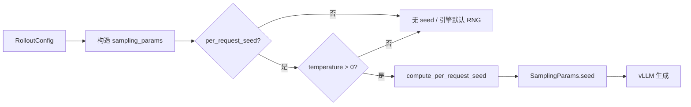

# Per-Request Rollout Seed 技术说明

## 1. 功能是什么

**Per-request rollout seed** 是 verl rollout 层的一项采样控制能力：在 stochastic 生成（`temperature > 0`）时，为**每一条**发往 vLLM 的生成请求单独设置 `SamplingParams.seed`，使采样结果对「基础 seed、样本索引、同 prompt 的第几次 rollout、训练步数」可复现、可区分。

在 True On-Policy recipe 中，该能力与 NPU PP 支持一并打包在 verl 源码 patch（`verl_patches/verl_npu_pp_per_request_seed_*.patch`）中，并与启动脚本环境变量配合使用；若所用 verl 已内置 `maybe_apply_per_request_seed`（及 PP 相关改动），则 patch 会自动跳过。若仅 PP 已 upstream，则仅 apply `verl_per_request_seed_*.patch` 增量。

---

## 2. 为什么需要它

### 2.1 默认 rollout 的随机性从哪来

未开启 per-request seed 时，verl 通常**不会**为每个 prompt 设置 `SamplingParams.seed`。vLLM 在引擎内部维护全局 RNG，同一 prompt 在不同 batch 位置、不同 worker、或任务重放时，可能得到不同的 token 序列——即便其它超参完全相同。

这对普通 RL 实验未必致命，但在以下场景会成为问题：

| 场景 | 无 per-request seed 时的风险 |
| --- | --- |
| **GRPO / GSPO**（`rollout.n > 1`） | 同一条 prompt 的多次采样应彼此独立且可复现；全局 RNG 难以保证「第 k 次 rollout」在不同运行间一致 |
| **训推一致性（True On-Policy）调试** | 需要隔离「数值路径差异」与「采样随机性」；采样不可复现会掩盖或放大 logprob 对齐问题 |
| **实验对比与回归** | 固定 `ROLLOUT_SEED` 后，期望相同 step、相同 prompt 得到相同 response |

### 2.2 与 `full_determinism` 的区别

verl 另有 `full_determinism`：在引擎启动与请求 fallback 路径上注入 **replica 级** seed（如 `replica_rank + config.seed`），偏向全局确定性。

| | `full_determinism` | `per_request_seed` |
| --- | --- | --- |
| 粒度 | 引擎 / replica 级 | **每条生成请求** |
| 默认 | 关闭 | 关闭（true_on_policy 脚本默认跟随 `ENABLE_TRUE_ON_POLICY` 开启） |
| 典型用途 | 全链路确定性调试 | 按 prompt、按 rollout 索引的可复现 stochastic 采样 |
| 关系 | 可同时开启；per-request seed 在请求进入 vLLM **之前**写入 `SamplingParams.seed`，不会被 fallback 覆盖 |

二者解决的不是同一个问题：True On-Policy 主要依赖 batch-invariant 对齐 logprob；per-request seed 解决的是 **rollout 采样本身的可复现性**。

---

## 3. 工作原理

### 3.1 配置项

| Hydra 配置 | 含义 | 典型值 |
| --- | --- | --- |
| `actor_rollout_ref.rollout.per_request_seed` | 主开关 | `true` / `false` |
| `actor_rollout_ref.rollout.seed` | 参与派生的基础 seed | 如 `42` |

True On-Policy 启动脚本用环境变量映射上述配置：

| 环境变量 | 映射 |
| --- | --- |
| `ROLLOUT_PER_REQUEST_SEED` | `per_request_seed`（默认跟随 `ENABLE_TRUE_ON_POLICY`） |
| `ROLLOUT_SEED` | `seed`（默认 `42`） |

### 3.2 Seed 派生公式

核心逻辑在 `verl/workers/rollout/utils.py` 的 `compute_per_request_seed()`：

```text
seed = (base_seed + sample_index × 1_000_003 + rollout_n × 1_009 + global_step × 9_176) & 0x7FFFFFFF
```

各因子含义：

| 因子 | 作用 |
| --- | --- |
| `base_seed` | 用户指定的 `rollout.seed`，实验级锚点 |
| `sample_index` | 当前 batch 内 prompt 标识（整数索引或 UUID 等字符串；字符串会先哈希为 int） |
| `rollout_n` | 同 prompt 的第几次采样（GRPO 中 `rollout.n` 的循环下标） |
| `global_step` | 训练步数，使不同 step 的同名样本 seed 不同 |

结果与 `0x7FFFFFFF` 按位与，保证落在 vLLM 可接受的 31 位正整数范围内。

`sample_index` 在代入公式前会经 `_coerce_sample_index()` 处理：整数或数字字符串直接使用，UUID 等 opaque 字符串则 SHA256 哈希为稳定 31-bit 整数（兼容 TransferQueue / v1 agent loop 路径）。

### 3.3 何时写入 seed

`maybe_apply_per_request_seed()` 在构造每条请求的 `sampling_params` 时被调用，逻辑为：

1. 若 `per_request_seed=false` → 不修改，保持 verl 原行为  
2. 若 `temperature ≤ 1e-5`（greedy）→ 不设置 seed，验证集等 greedy 路径不受影响  
3. 否则 → 按上式计算并写入 `sampling_params["seed"]`

注入发生在 **agent loop 向 vLLM 发请求之前**，覆盖 async rollout（`agent_loop.py`）与 TransferQueue rollout（`agent_loop_tq.py` 或 v0.8 的 `main_ppo_sync.py`）等路径。



### 3.4 vLLM 侧

请求到达 `vllm_async_server` 时，`SamplingParams` 已携带 per-request seed。若同时开启 `full_determinism`，仅当 upstream 尚未设置 `seed` 时才使用 replica fallback——per-request seed 优先生效。

---

## 4. 在 True On-Policy 中的角色

True On-Policy 的训练链路是：

```text
Rollout（vLLM）采样 response → Training（Megatron）重算 logprob → 用差值更新策略
```

训推一致性（batch-invariant、runtime patch 等）解决的是 **两侧 logprob 数值对齐**；per-request seed 解决的是 **Rollout 侧 stochastic 采样可复现**。两者互补，默认在脚本中同时开启，但可独立关闭：

```bash
# 仅训推一致性，不要 per-request seed
ENABLE_TRUE_ON_POLICY=1 ROLLOUT_PER_REQUEST_SEED=false \
  bash verl_ascend_recipe/true_on_policy/scripts/grpo/run_grpo_qwen3_4b_megatron_npu.sh

# 仅 per-request seed，关闭 batch-invariant 训推对齐
ENABLE_TRUE_ON_POLICY=0 ROLLOUT_PER_REQUEST_SEED=true \
  bash verl_ascend_recipe/true_on_policy/scripts/grpo/run_grpo_qwen3_4b_megatron_npu.sh
```

verl 若尚未内置该能力，在 `VERL_USE_EXTERNAL_MODULES=verl_ascend_recipe.true_on_policy.patch` 触发 import 时，patch 模块会向 verl 源码树幂等应用 `verl_npu_pp_per_request_seed_*.patch`（或 PP 已合入时的 seed 增量 patch），无需用户手动打补丁。详见 [README.md](./README.md) Layer 1 说明。

---

## 5. 使用方式

### 5.1 环境变量（推荐）

适用于 `scripts/grpo/`、`scripts/gspo/`、`scripts/dapo/` 下全部 Megatron + vLLM NPU 脚本：

```bash
# 默认：ENABLE_TRUE_ON_POLICY=1 时 per-request seed 一并开启，基础 seed=42

# 显式指定基础 seed
ROLLOUT_PER_REQUEST_SEED=true ROLLOUT_SEED=42 \
  bash verl_ascend_recipe/true_on_policy/scripts/grpo/run_grpo_qwen3_4b_megatron_npu.sh

# 关闭 per-request seed
ROLLOUT_PER_REQUEST_SEED=false \
  bash verl_ascend_recipe/true_on_policy/scripts/grpo/run_grpo_qwen3_4b_megatron_npu.sh
```

### 5.2 Hydra 命令行

不通过本 recipe 脚本、直接调用 verl 入口时：

```bash
python3 -m verl.trainer.main_ppo \
  actor_rollout_ref.rollout.per_request_seed=true \
  actor_rollout_ref.rollout.seed=42 \
  ...
```

DAPO 将入口换为 `python3 -m recipe.dapo.main_dapo` 即可，rollout 配置项相同。

---

## 6. 行为说明

1. **仅对 stochastic 采样生效**：`temperature=0` 或 greedy 验证路径不注入 per-request seed。  
2. **`rollout.n > 1` 时**：同一 prompt 的 n 次采样通过 `rollout_n` 项获得不同 seed，彼此独立且可复现。  
3. **跨 step 变化**：`global_step` 参与计算，同一 prompt 在不同训练步的 seed 不同，避免 step 间采样完全相同。  
4. **与训推一致性独立**：关闭 `ENABLE_TRUE_ON_POLICY` 不影响 patch 中 per-request seed 的 verl 能力；仅环境变量默认不再开启 `per_request_seed`。  
5. **多轮 agent / tool 场景**：同一 `request_id` 内 generator 状态仍由 vLLM 连续推进；per-request seed 作用于请求级 `SamplingParams`，不改变多轮会话的状态机语义。

---

## 7. 相关文档

| 文档 | 内容 |
| --- | --- |
| [../README.md §4](../README.md) | 环境变量速查与启动示例 |
| [README.md](./README.md) | Patch 三层架构与 Layer 1 自动 apply 机制 |
