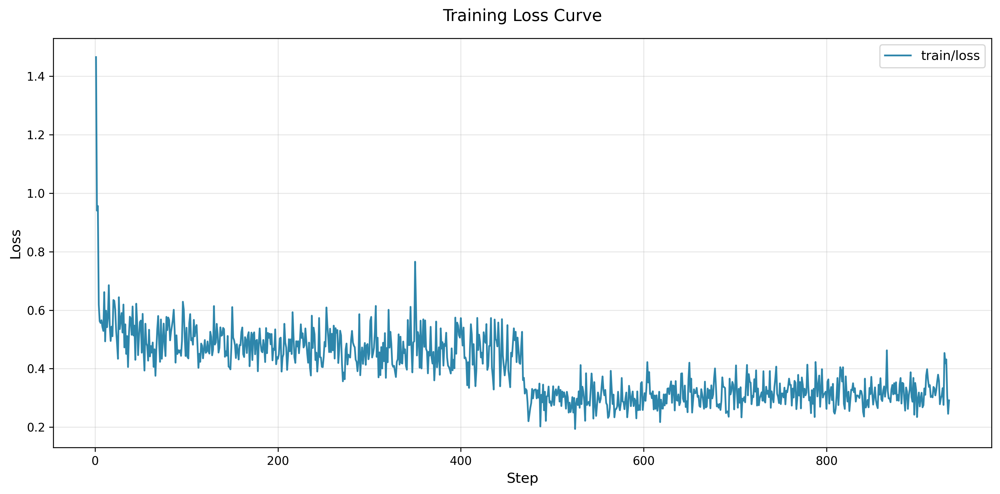
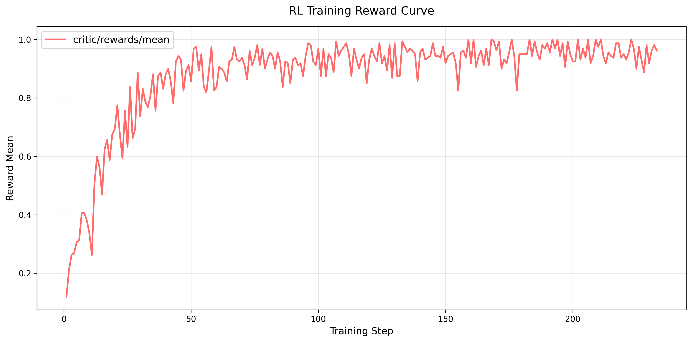

# Ascend A2/A3 + VeRL Qwen3 SFT/RL Full Training Guide
## 1\. Introduction

This document provides an end-to-end standardized practice workflow 
for **Supervised Fine-Tuning (SFT)** and **Reinforcement Learning (RL)** of Qwen3-series models. 
The entire training pipeline is built on **Ascend A2/A3 hardware platforms** and the **VeRL v0.7.1** training framework.

Taking the classic mathematical reasoning dataset GSM8K as the training example, 
this tutorial adapts to the Ascend software and hardware ecosystem. 
It covers the full process of environment configuration, data preprocessing, model training, 
and metric visualization, which can be directly deployed for fine-tuning and alignment of Qwen3-series models.

## 2. Environment Requirements

This chapter details the verified hardware specifications, software versions, and container images for stable VeRL training and Qwen3 model adaptation.

### 2.1 Hardware Environment

This training pipeline supports 2 types of Ascend devices. Users can select the appropriate hardware according to model scale:

- **Ascend A2**: 8 NPUs per node.

- **Ascend A3**: 16 NPUs per node.

### 2.2 Software Environment

All software versions are fully compatible and pre-configured in the official container images. No additional dependency installation is required for out-of-the-box deployment.

|Component| Version                                                                                                                                                        |Description|
|---|----------------------------------------------------------------------------------------------------------------------------------------------------------------|---|
|CANN| 8.5.0                                                                                                                                                          |Core driver and operator library for Ascend computing|
|Python| 3.11                                                                                                                                                           |Stable version adapted for VeRL and model training scripts|
|VeRL Framework| 0.7.1                                                                                                                                                          |Unified training framework for LLM SFT and RL alignment|
|A3 Docker Image| [quay.io/ascend/verl:verl-8.5.0-a3-ubuntu22.04-py3.11-v0.7.1](https://quay.io/repository/ascend/verl?tab=tags&tag=verl-8.5.0-a3-ubuntu22.04-py3.11-v0.7.1)     |Optimized for Ascend A3, integrated with complete VeRL project|
|A2 Docker Image| [quay.io/ascend/verl:verl-8.5.0-910b-ubuntu22.04-py3.11-v0.7.1](https://quay.io/repository/ascend/verl?tab=tags&tag=verl-8.5.0-910b-ubuntu22.04-py3.11-v0.7.1) |Optimized for Ascend A2, integrated with complete VeRL project|

## 3. Training Dataset

### 3.1 Dataset Overview

This tutorial adopts the **GSM8K (Grade School Math 8K)** dataset, a classic open-source benchmark 
for evaluating the mathematical reasoning capabilities of large language models. It consists of a large number of 
elementary math word problems and is widely used for LLM supervised fine-tuning and reinforcement learning alignment tasks.

Dataset Repository:[https://huggingface.co/datasets/openai/gsm8k](https://huggingface.co/datasets/openai/gsm8k)

### 3.2 Dataset Adaptation

The VeRL official preprocessing scripts are built into the provided Docker images. 
The pipeline automatically completes dataset format conversion to generate standard data for SFT and RL training.

## 4. Full Model Training Pipeline

This chapter includes 2 core training modules: **SFT** and **RL**. We provide standardized pipelines based on Qwen3-0.6B and Qwen3-8B, 
which can be extended to other Qwen3 Dense and MoE models by modifying relevant configuration parameters.

### 4.1 SFT (Qwen3-0.6B + GSM8K)

We perform supervised fine-tuning on the lightweight Qwen3-0.6B model using the GSM8K dataset to enhance its fundamental mathematical reasoning ability. 
The pipeline includes data preprocessing, task launching, and training metric visualization.

#### 4.1.1 Data Preprocessing

Use the built-in VeRL script to standardize and clean the GSM8K dataset, generating formatted data for SFT training. No extra engineering deployment is required.

```bash
# GSM8K SFT data preprocessing
# local_dataset_path: Path for raw dataset storage
# local_save_dir: Output path for processed SFT data
python verl/examples/data_preprocess/gsm8k_multiturn_sft.py \
--local_dataset_path "${HOME}/gsm8k" \
--local_save_dir "${HOME}/gsm8k_sft"
```

#### 4.1.2 Launch SFT Training

After data preprocessing, execute the training script to start distributed SFT on Ascend devices.

```bash
# Launch Qwen3-0.6B SFT training on Ascend NPU
bash run_sft_qwen3_0_6b_npu.sh
```

#### 4.1.3 Loss Curve

Training loss is recorded in real time during the training process. 



### 4.2 RL (Qwen3-8B + GSM8K)

We perform RL alignment on the Qwen3-8B model. 
The reward-driven optimization refines the model’s reasoning logic and improves the accuracy and normalization of mathematical reasoning outputs.

#### 4.2.1 Data Preprocessing

Run the RL preprocessing script to generate RL dataset, supporting reward calculation.

```bash
# GSM8K RL data preprocessing
python verl/examples/data_preprocess/gsm8k.py \
--local_dataset_path "${HOME}/gsm8k" \
--local_save_dir "${HOME}/gsm8k_rl"
```

#### 4.2.2 Launch RL Training

Start the RL training task for Qwen3-8B after data preparation is completed.

```bash
# Launch Qwen3-8B RL training on Ascend NPU
bash run_rl_qwen3_8b_npu.sh
```

#### 4.2.3 Reward Curve

The core monitoring metric for RL training is reward value. 
A normal convergence trend presents a steady increase in average reward that finally plateaus, 
which demonstrates continuous optimization of the model’s reasoning policy.




## 5. Extension and Compatibility

- **Model Extension**: This pipeline is compatible with all Qwen3-series Dense models (1.7B, 4B, 14B, etc.) and MoE models. 
Only model parameters and configuration files need replacement for migration.

- **Hardware Adaptation**: Small-scale models are recommended for Ascend A2 training. 
8B+ dense models and MoE models are recommended to run on Ascend A3 for higher throughput and training stability.

- **Dataset Migration**: The pipeline supports custom reasoning and dialogue datasets. 
Users only need to modify the corresponding preprocessing scripts and training configurations.

## 6. Troubleshooting

- **Environment Mismatch**: Strictly use the specified Docker images and CANN version. 
Version inconsistency will cause operator errors and abnormal NPU training.

- **Data Path Error**: Ensure sufficient read/write permissions for the dataset directory to avoid data loading failures during preprocessing and training.

- **Convergence Issues**: If training loss fails to decrease or reward fails to increase, 
adjust hyperparameters including learning rate, batch size, and training epochs.
